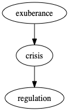

A number of circles are being completed by this year's workshop at the University of Ljubljana on Risk and Artificial Intelligence

* The [previous workshop](https://github.com/munichpavel/risk-ai-workshop/tree/v2020-02-uni-lj) was my last talk for non-virtual people before Covid lockdowns, and this workshop is my first post-lockdown
* The EU's proposed [AI Act](https://eur-lex.europa.eu/legal-content/EN/TXT/PDF/?uri=CELEX\%3A52021PC0206) and the German regulator's [IT Requirements for Asset Managers](https://www.bafin.de/SharedDocs/Veroeffentlichungen/EN/Meldung/2020/meldung_2020_05_25_KAIT_en.html) connect my recent work in causality in AI and MLOps to the regulatory capital frameworks of my first workshop back in 2015.

What didn't change was

* the engagement and curiosity of the students in [Professor Tomaz Kosir's](https://www.fmf.uni-lj.si/~kosir/english.html) [Masters Program in Financial Mathematics](https://www.fmf.uni-lj.si/en/study-mathematics/programmes/2fima/2021/).
The basic format stayed the same, with four lectures and accompanying example

* a chance to explore topics in risk and AI that I find interesting and important

For this year's workshop, the main topics were

1. Risk, Regulation and AI, with focus on the [EU-proposed regulation on AI](https://eur-lex.europa.eu/legal-content/EN/TXT/PDF/?uri=CELEX:52021PC0206)
1. How elements of discrete geometry are useful for modeling algorithms ("graphical models"), generating [interesting fake data](https://github.com/munichpavel/fake-data-for-learning), and understanding [Simpson's paradox](https://en.wikipedia.org/wiki/Simpson%27s_paradox).
1. Why data scientists and AI practitioners should engage with causality, and not automatically settle for correlation as a proxy (spoiler alert: I give an example of getting your return-on-investment wrong if you settle for correlation)
1. Why we need rigorous data science practices in high-risk AI like credit scoring

Continue reading for more on each of these topics, plus a final takeaway conclusion.

## Risk, Regulation and AI

The [first lecture](resources/ai-risk-and-discrete-geometry.pdf) goes through the well-established pattern of

  

starting with a brief history of financial disaster, and ending with the current crisis in AI. But what crisis? We don't have government bailouts of failed AI companies, or massive unemployment because of AI gone wrong as with financial crises.

The crisis facing us with AI is not so much a financial one, as a societal one, as [Cathy O'Neil](https://mathbabe.org/) persuasively argues. It is

So regulators should step in and shut down high-risk AI, right? No, and here is where risk management comes in. Note the name of this field is risk *management* and not risk *elimination*. As Bernadette Walters, the director of the quantitative risk modeling division of Deutsche Bank in my first post-academic job, put it, the job is risk management is to balance risk and return.

The EU's proposed AI Act sets out precisely this balance, recognizing both the potential for societal good as well as for crisis:

## Discrete Geometry for Risk and AI

The [second lecture](resources/discrete-geometry.pdf)

## Correlation and Causality

The [third lecture](resources/correlation-causality.pdf)

## Risk and AI in Practice: Credit Scoring

In the [final lecture](resources/risk-ai-practice.pdf)

## Takeaways

### The next generation

The masters students showed not only the curiosity and appetite for learning you might expect from top students, but also an interest in using their expertise and creativity for the good of society. This gives me hope.

### Rigorous practice rather than [Luddism](https://en.wikipedia.org/wiki/Luddite)* for human-centered AI

Sure, there will be applications of AI for which a Luddite "Don't go there" is the appropriate response, but for the examples of the workshop, rigorous practice is what ensures your AI model is compatible with the values articulated in the [EU's AI Act](https://eur-lex.europa.eu/legal-content/EN/TXT/PDF/?uri=CELEX:52021PC0206), such as

* think deeply about your data and the process that generates it, don't outsource thinking to all-purpose algorithms
* think deeply about causal mechanisms, since correlation is a proxy, and sometimes a dangerous one.

### Modern software practices like MLOps (aka CI/CD for ML) are effective tools for managing operational risk

A big change for this year's workshop was to think of the workshop repository like an application, and automate everything that made sense to automate. I already had unit tests for code I had written, but I was still manually checking that notebooks actually ran without error, and manually compiling and versioning the (laTeX) slides, all manual processes that could and did result in error and last-minute frantic fixes.

So what is the critical functionality of the workshop repository that should be tested and delivered like other software?

1. Continuous integration: All example and exercise notebooks should run without error on the students' laptops, including a machine learning pipeline for credit scoring.

1. Continuous delivery: All slides should be generated based on the tested code state on the main branch.

Was my extra effort worth it? Yes. Did I eliminate all errors for the workshop? Not all, but I reaped the expected benefits, namely

#### Preservation of my own sanity at crunch time

For the typos and other bugs that popped up while preparing and even during the workshop, I could focus on the task at hand, and not the (now-automated) manual steps of re-running laTeX builds and manually adding them to version control.

The biggest case of sanity-preservation via automation was in coming up with synthetic data for credit scoring that exhibited desired characteristics. In addition to data versioning, I wrote a ratchet test to automatically test the generated data and fitted models had the desired traits.

#### Improved mean-time-to-recovery

I didn't keep precise statistics, but my gut says we had the same percentage of dependency install mishaps on student laptops this year as last, but (again, gut-based) the process of diagnosing and fixing issues went faster.

One benefit of the CI / CD pipeline--which tested custom code and notebook execution on Windows, Mac and Linux operating systems--was that I could focus faster on what was really wrong. Specifically, I knew it wasn't just a Windows thing, my go-to explanation in the last round.

In general, this faster-focus-on-root-cause benefit is one of the reasons I still practice and adore [test-driven-development](https://www.oreilly.com/library/view/test-driven-development/0321146530/).
