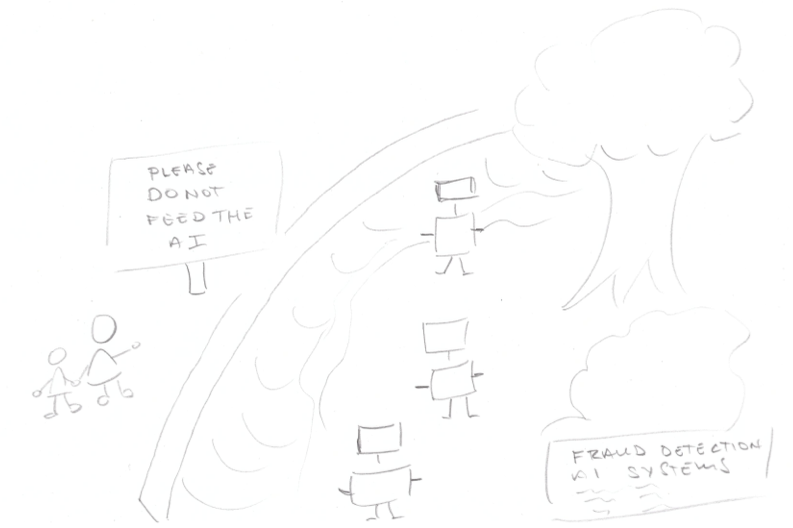

I've seen many meetings about AI and risk fly off the rails because the discussion is too abstract and removed from actual practice. That's why our first round of training sessions feature an AI Systems Zoo of 20 real-life examples of AI and non-AI systems as part of [edON IT Academy](https://www.edon.lt) and [Kibernetinio saugumo ekspertų asociacija](https://ksea.lt) program "Cybersecurity and risk management (GRC)"

Why non-AI systems? Because just like in a zoo, it's critical to be able to recognize which software is AI and which isn't according to accepted and legally binding definitions. You wouldn't want your child writing her or his school report about the tiny polar bears in the zoo with grey fur who scurried around the trees and ate seeds 🙂.

If you would like help with AI Literacy or your AI inventory for the EU's AI Act, please reach out to me at paul.larsen.sp@gmail.com or paul@mkdev.me.
