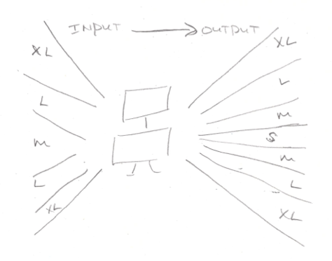

In Saturday's session of our course "AI, Cybersecurity and Risk Management," we dug into AI failure modes in our "AI, Cybersecurity and Risk Management" training. In risk and IT security, it's our job to focus on what can go wrong. This doesn't mean eliminating risk, but it does mean identifying failure modes, assessing how likely and severe they are, and then making a risk vs return decision.

But to understand AI failure modes, you have to peek under the hood of AI. I've never been a fan of the usual AI trainings that dazzle the participants with all of the mathematics and algorithms that are used. Instead, we're focusing on concrete examples (our AI System Zoo) and mental models to help us 1. identify AI risk (is it AI? what are it's failure modes?) and 2. decide on risk management (e.g. accept, mitigate, eliminate).

Here's one mental model we used: the input-output t-shirt size model

A hallmark of AI system is that it can accept a larger variety of inputs (up to XL) and map the inputs to a larger (though smaller than input) variety of outputs compared to non-AI IT systems.

This heuristic isn't part of the EU AI Act's definition of AI systems, but it does help us understand the notions of "autonomy" and "inference" that are in the [official definition](https://eur-lex.europa.eu/eli/reg/2024/1689/oj/eng).

As one of the participants noted, IT systems seem to evolve from normal software to AI as "businesses [are] moving towards personalized recommendations."

A big thank you to [edON IT Academy](https://www.edon.lt) and [Kibernetinio saugumo ekspertų asociacija](https://ksea.lt) for asking us at [mkdev.me](mkdev.me) to run this training.
