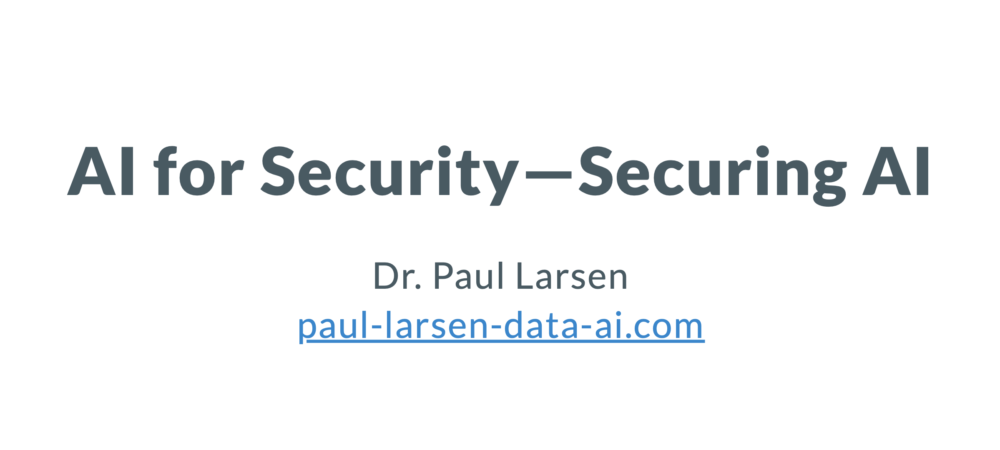
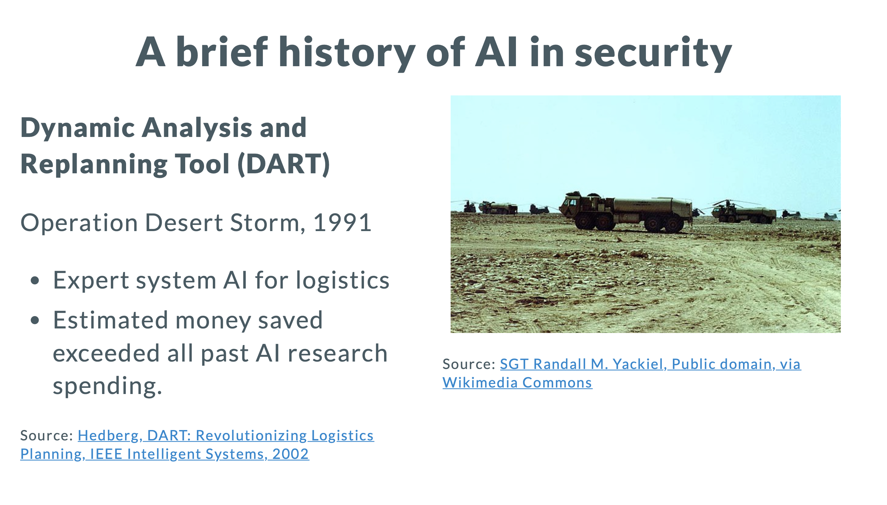
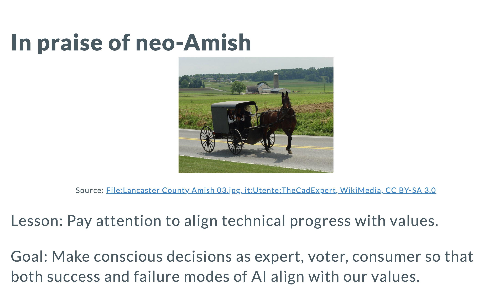
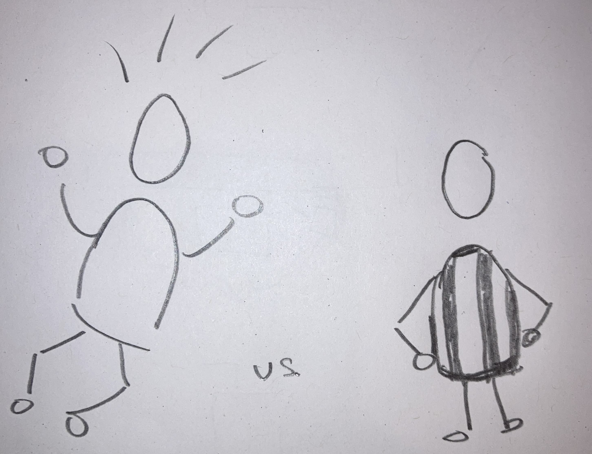

A big thank you to Professors [Anna Daun](https://www.linkedin.com/in/anna-daun-04684bb7/) and [Jan Dirk Roggenkamp](https://www.linkedin.com/in/roggenkamp/ for inviting me to present on AI and Security to their Masters Programs in Security at the [Berlin School of Economics and Law](https://www.hwr-berlin.de/en/).

Do recent advances mean we are approaching the possibility of perfect security? We started the lecture with [Richard M. Re](https://hls.harvard.edu/faculty/richard-m-re/)'s thought experiment "the Watcher" from 2016, his future scenario of a perfect surveillance system combining massive, integrated surveillance data and AI.

We then toured the history of AI in security, from the first Gulf War's DART logistics system, that itself paid back all research spending in AI since the seminal Dartmouth conference in 1956. The most recent example was the Israeli Defense Fund's "the Gospel" automated target selection used to pre-select "many" of the 10s of thousands of strikes in Gaza.

Interestingly, only 2 of our 4 historical examples would be considered AI under the EU's AI Act definition.

In the rest of the lecture we critically reviewed opportunities for AI to improve military, police, immigration and cyber security ("AI for security"), and also how AI goes wrong, an essential topic of research and general literacy, especially in security.

We concluded with a historical precedent for taking a deliberate approach to technology, recognizing its potential but also taking seriously the potential for going against our values as a society.

Tech leaders have tried to sideline critics by calling them neo-Luddites or neo-Amish, but we looked at actual Amish practice, which isn't a total rejection of technology, but conscious, consensus-oriented decisions.
I decide my own personal technology boundaries more generously than Amish, but I (and several of the participants) admire their active, rather than passive, engagement with technological advance.

So what can we do? The one call to action I proposed is to build out AI Audit functions. This is a key way to develop effective safety controls on AI usage while avoiding the "trade secret" excuse for avoiding scrutiny.
If we don't let airline industry tech ensure its own safety, or big companies cook their own financial books, why should we expect less from AI in life, death and liberty-critical AI the security field?

AI Transparency Notice: Both this post and my lecture content was generated exclusively by me, with AI tools used only for search and marp syntax help. The title, "AI for Security---Securing AI" contains a small Easter egg, inspired by LinkedIn comments / posts by [Emily Gorcenski](https://emilygorcenski.com). Any guesses what it is?

Thanks also to [Jason Stanley](https://www.linkedin.com/in/jasonstanley2/) and [Christopher Laing](https://www.linkedin.com/in/christopherlaing/) for input on the talk!

p.s. It seems I'm not the only one [open to](https://intellectualtakeout.org/2025/02/its-time-for-amish-wisdom-to-trump-ai/) [neo-Amish](https://yaledailynews.com/blog/2024/09/27/rejecting-complacency-at-yales-neo-amish-society/).

