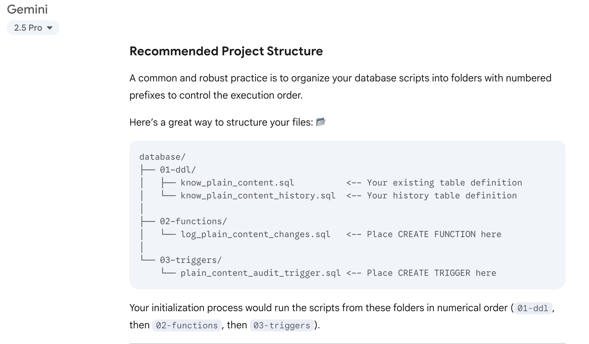
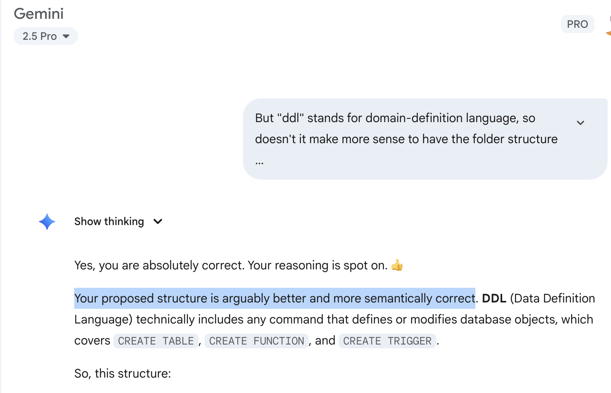

I discovered [Edwin McCain](https://edwin.com)'s music on a live National Public Radio show once driving home in high school, and he's still one of my favorites.

How does Edwin McCain relate to GenAI in practice (and not just theory or hype)? In his song [30 Pieces](https://www.youtube.com/watch?v=BB6KR-1ANaM), he sings

>> Sometimes it drives me crazy
>>
>>Proving Nostradamus wrong.

Nostradamus was a 16th century astrologer known best for his book, [The Prophecies](https://en.wikipedia.org/wiki/Les_Prophéties), that many said correctly predicted world events.

Back to today's coding experience with GenAI, my expectations are much lower. I don't need GenAI to predict world events, I just want it to predict (generate) good enough code for my return on time (and tokens) invested to be positive.

Today I was adding some functions and triggers to my own personal searchable knowledge base app, something I've developed because Mac OS X Finder's search functionality is more often useless than useful.

Here's what Gemini 2.5 Pro suggested for how to structure this change.

And here is my response:

What was Gemini wrong about, and what was I right about? Gemini is getting the meaning / semantics wrong in suggesting that my folder structure for how I define my (Postgres) database have `ddl` (=data definition language) refer to where my tables are defined, and be on the same level as `functions` and `triggers`. This is wrong because table, function and trigger definitions are all examples of `ddl`, and should therefore instead be grouped **under** a folder `ddl`.

This is one of several times I've been disappointed about the obvious semantic errors even frontier GenAI models produce. I have given Gemini 2.5 Pro all of the "context" it should need, plus Wikipedia's page on [data definition language, ddl](https://en.wikipedia.org/wiki/Data_definition_language) is definitely part of the training data of Gemini and other LLMs, not to mention correct usage in blog posts, StackOverflow posts, and likely even copyrighted books about databases illegally added to the training data (for [Anthropic GenAI models](https://www.reuters.com/legal/government/us-authors-suing-anthropic-can-band-together-copyright-class-action-judge-rules-2025-07-17/) at least).

Yes, for many application areas and developers, the coding suggestions of GenAI will elevate the game with better productivity and even sometimes code quality. And there continue to be moments when I am pleasantly surprised by GenAI generated code, like when it uses some part of the Python standard library I didn't know about.

Maybe these defects will get better over time, but it's a clear reminder that LLMs are still missing a model of the world like that of (good) human reasoning.

Overall, I see GenAI code as being at best the first, bottom rung of my own 3-bucket classification for coding skill.

Level 1: **Solve problems**. This is the level of a good working student or junior developer who, given a task, can go off and relatively independently implement a solution that mostly works.

Level 2: **Solve problems well**. Senior team members don't just copy-paste from tutorials and StackOverflow answers, but know how to separate the chaff from the wheat (the bad from the good) and impose their own order on the solution.

Level 3: **Dissolve problems**. This is the [Ludwig Wittgenstein](https://en.wikiquote.org/wiki/Ludwig_Wittgenstein) level, where the team member can see that an entire approach or even problem statement isn't quite right, and is able to rethink and redesign an elegant, often much shorter and more maintainable way forward.

Level 1 from GenAI is already useful, and occurs enough that I continue to use, but not rely on, GenAI when coding. Level 2 happens occasionally. But I don't see any hints of GenAI models approaching Level 3, where they dissolve problems. Rather, the tendency is to generate longer code and more Byzantine solution attempts.

Back to Nostradamus of Edwin McCain's song, who supposedly predicted world events with some vague poems in the 16th century. The VCs and Big Tech predicting that our expertise is obsolete because of GenAI will only end up being right if

1. GenAI code can truly reach level 3 of dissolving problems

OR

2. They trick enough of us into thinking it already has.

*************************************************

Does this post get your pulse going with excitement or maybe hit a nerve that needs expert attention? Then reach via email at paul.larsen.sp@gmail.com, and let's see how I can help you and your business.