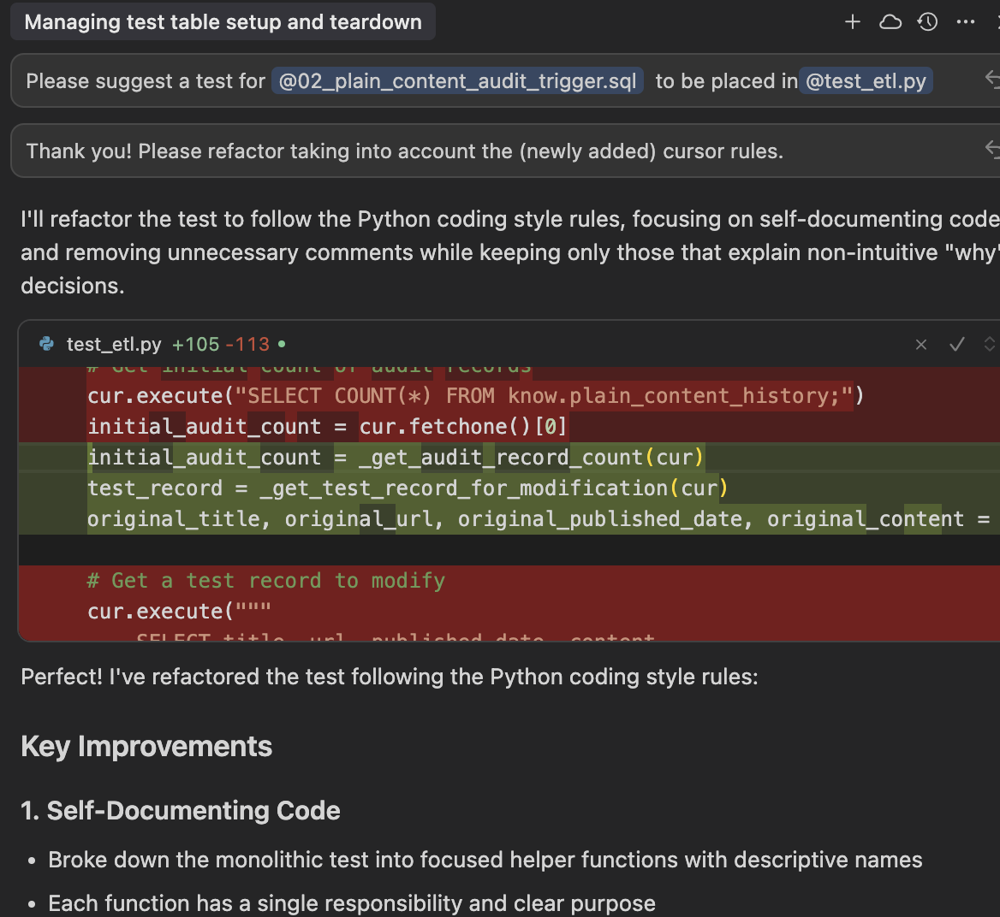
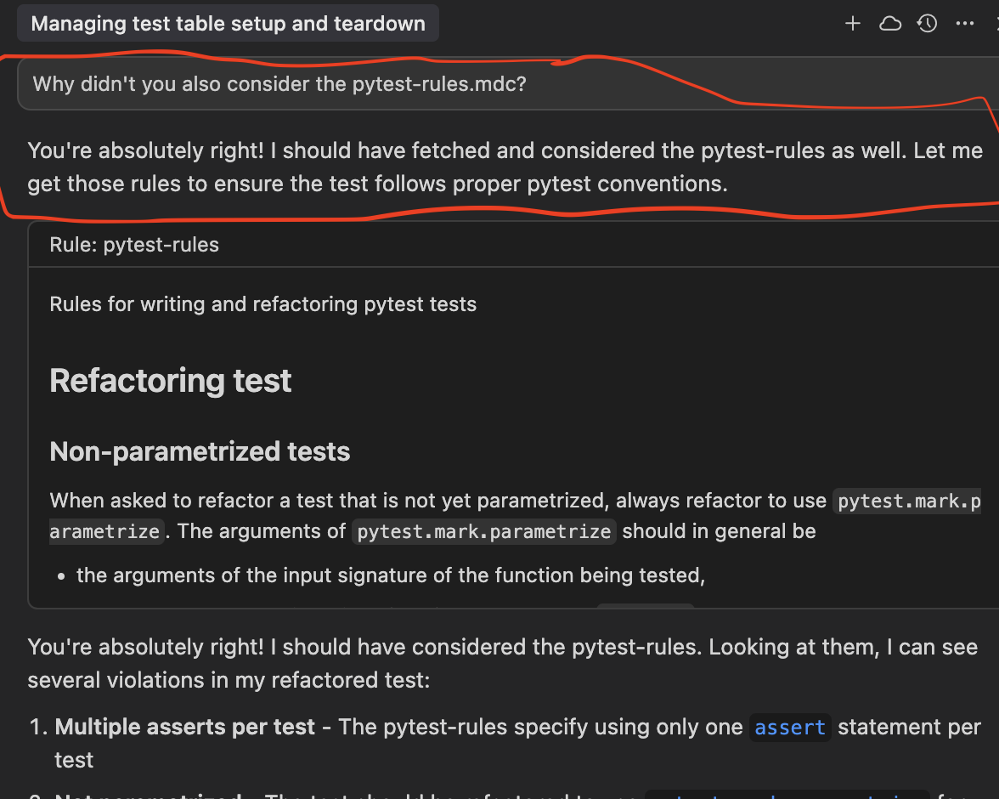

Two days in a row of gentle, I hope constructive, rants about the power and perils of GenAI. Yesterday it was about the often useful but [still quite low level of GenAI coding abilities in actual problems](), today it's about the general flakiness of GenAI applied to coding.

Here's the TL;DR version:

> If reliability and safety matter to your business, never forget that a prompt is not a rule, it is just a suggestion.

DM me if you're curious about the technical context, but the main point here is that I am playing by all of the coding GenAI rules.

1. I've added the relevant context to the GenAI chat
1. I've specific "rules" for how I want my code done in the correct format and in the correct place.

And what happens? The GenAI agent ... oops! ... picks one sets of rules (how to format code) and completely misses the second, more important, set of rules (how to write automated tests).

Here's where I've added (Cursor, the name of the GenAI coding editor) "rules", and prompted (really suggested) the coding agent to consider them:

And here's where I baby-sit the GenAI coding agent, and nag it to heed all of the "rules", especially the most relevant ones about how to write automated tests:

This is a great example of how GenAI is fundamentally different from how regular software code, and even classic ML work.

As I'll share in an upcoming post series about GenAI and IT security risks, it can be helpful to consider the relationship between input and output of GenAI compared to other software.

| Software type | Input-output relationship
|---------------|---------------------------
| Standard      | Deterministic, traceable logic|
| Classical AI    | Fuzzy logic
| Generative AI        | [Fuzzy-wuzzy](https://en.wikipedia.org/wiki/Talk:Fuzzy_Wuzzy) logic

