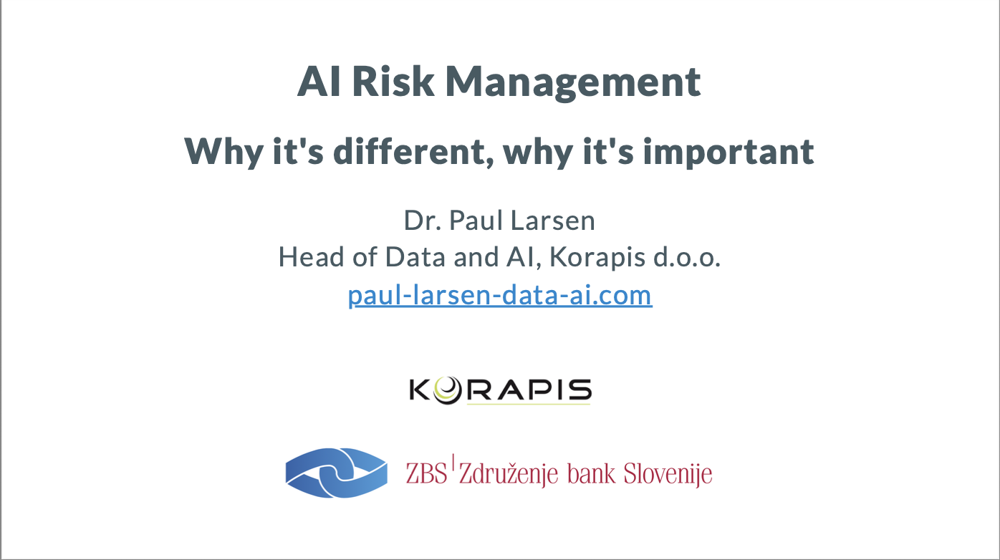
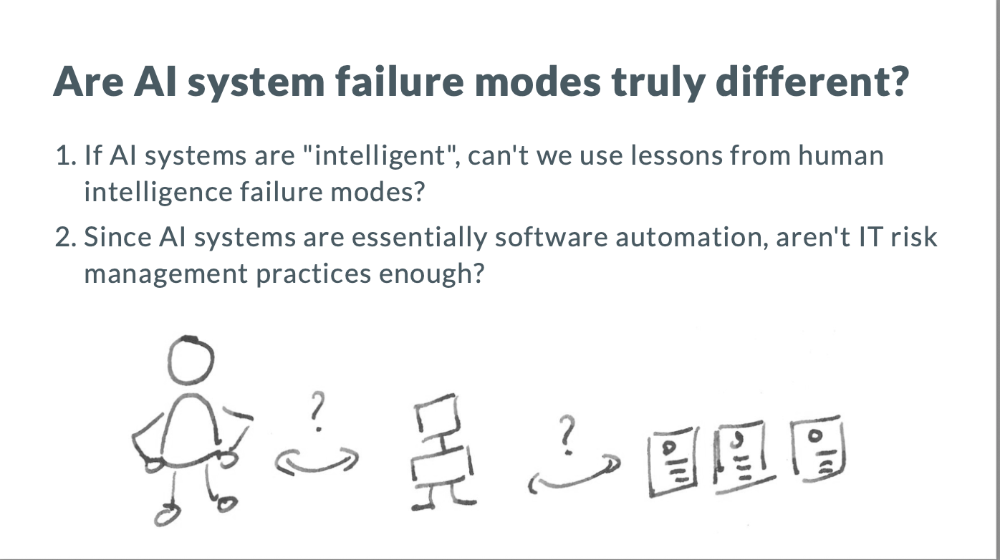
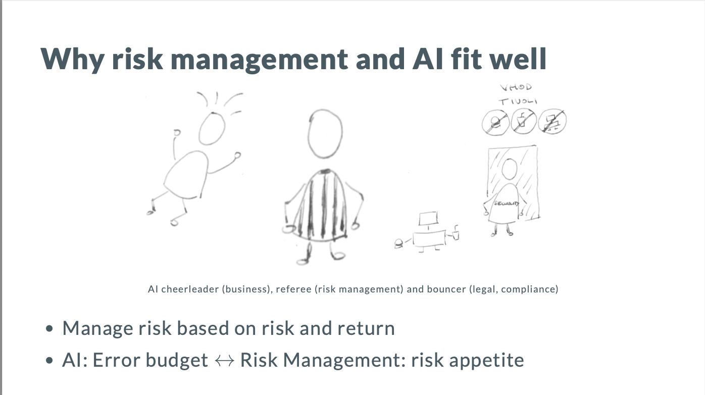
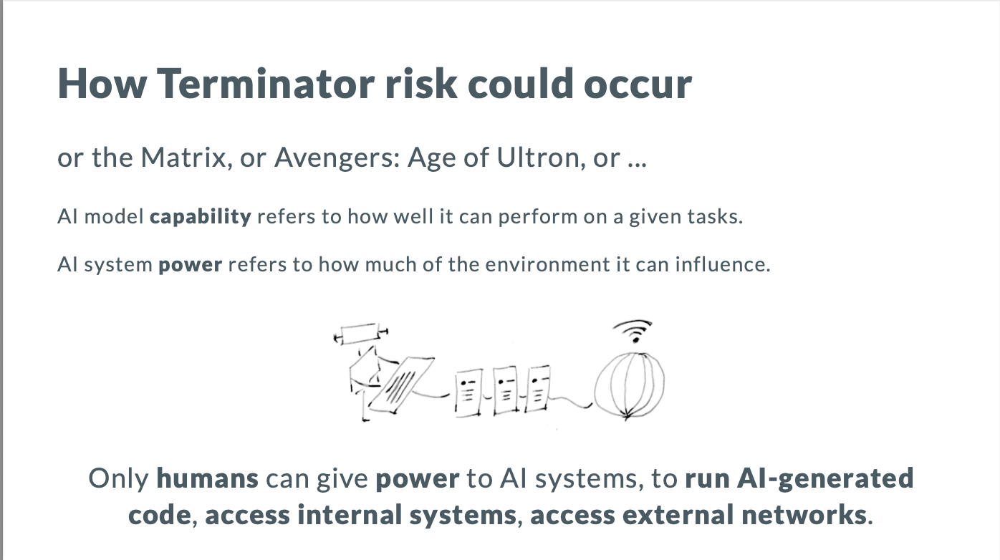

A big thank you to [Ksenija Jaklin](https://www.linkedin.com/in/ksenija-jaklin-7318a2209/) and [Matej Krumberger](https://www.linkedin.com/in/matej-krumberger-99098b28a/) of the Slovenian Banking Association, [Združene Bank Slovenija](https://www.zbs-giz.si/en/), on AI Risk Management.

We looked at two aspects of risk management for AI systems:

1. **Why it's different**: Is AI risk management really that different from managing human intelligence risk or non-AI software risk? We took examples from research and the headlines to show how AI risk management is different from both human and non-AI IT risk management.

2. **Why it's important**: The risk function is uniquely suited for managing AI risk, as its emphasis on risk and return is the right approach for AI, where potential gains are great, but there's always an error budget too.

To wrap things up, we took a detailed look at what catches the most headlines, but in practice hasn't been a concrete risk ... until now? I mean Terminator risk, aka the Singularity, aka Age of Ultron, aka the Matrix. With AI writing code, if we humans don't exercise care about the integration power we give AI coding agents, this risk could perhaps leave the realm of science fiction.

-------------

Does this post get your pulse going with excitement or hit a nerve that needs expert attention? Then reach out to me on [LinkedIn](https://www.linkedin.com/in/paul-larsen/) or email at paul.larsen.sp@gmail.com, and let's see how I can help you and your business.