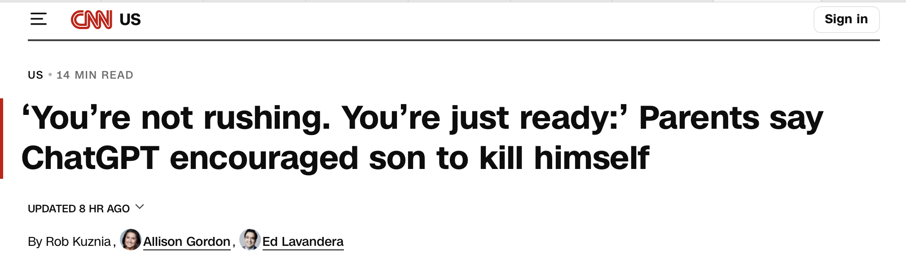

What do you do with a consumer product that poses danger to its users? You recall it until safety requirements are met.

Does encouraging users to take their own lives pose a safety risk? Absolutely.

Recall ChatGPT now for consumer usage.

This isn't an anti AI rant. I work in Ai myself, both developing AI solutions and teaching about AI safety issues.

This is about companies like OpenAI putting out products that fail ordinary safety requirements. I will keep developing AI, especially ways to make it safe, and so should others. But when it comes to consumer products, dangerous products, AI or not, should be recalled.

Source: [Rob Kuznia, Allison Gordon, Ed Levandera, CNN](https://edition.cnn.com/2025/11/06/us/openai-chatgpt-suicide-lawsuit-invs-vis)
