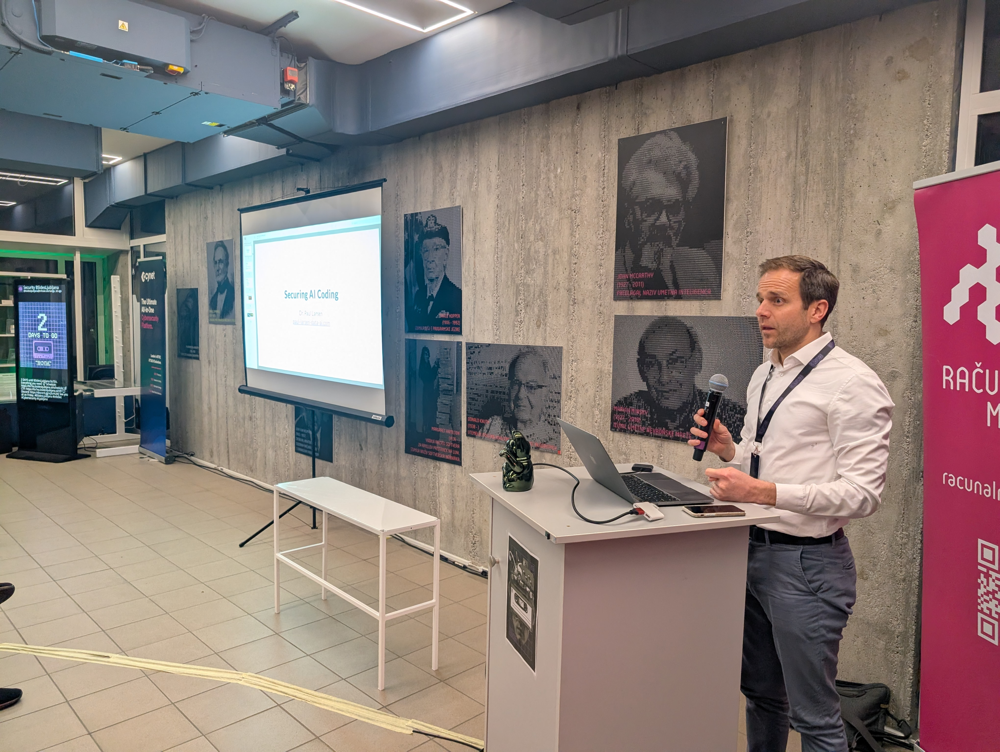
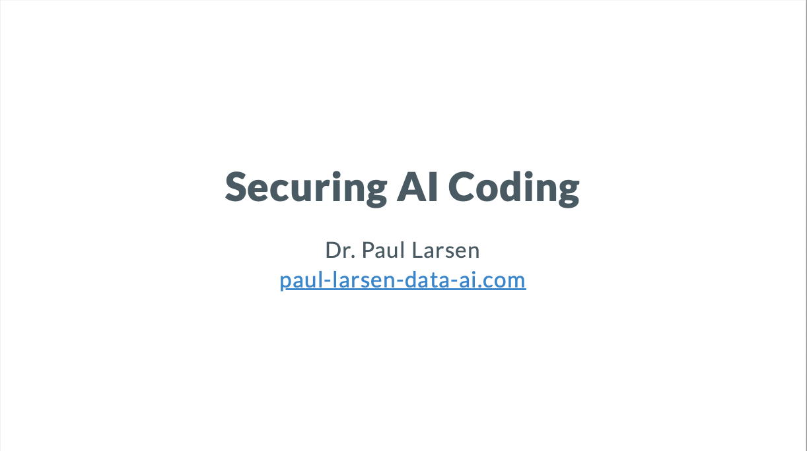
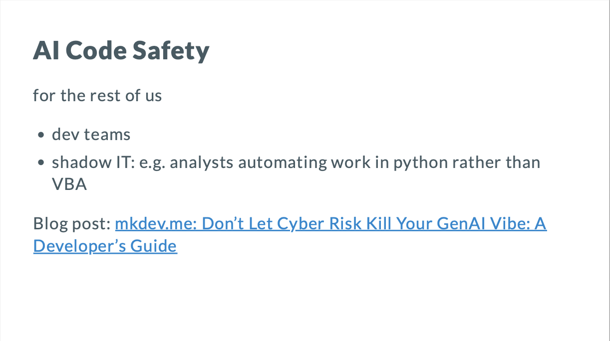
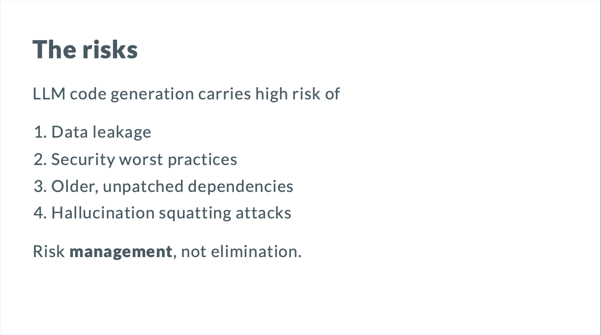

One of the many reasons I loved the IT security event, Ljubljana BSides, was the chance to hear (and give) lightning talks at the end.
I gave a 7 minute take on recent work with customers about the security risks of AI coding tools, and how to manage them.

What is your company doing to get the benefits of AI coding agents, while managing data exfiltration and supply chain risks?

